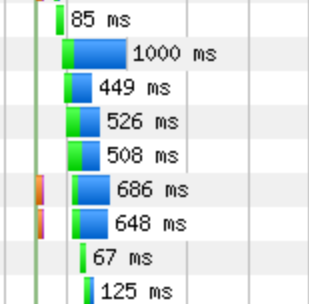
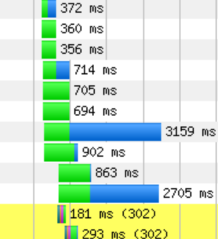

* About how long did it take the server to begin sending back the first resource?

* At about what time did the server finish sending the last resource?

* At about what time did Start Render occur? Document Complete?

* How many resources did your site request?

* Look at the waterfall chart for the Repeat View. Is anything different? How many resources were requested?

* Judging by the "sub-bars", which portion of the request/response cycle seems to take longest?

* At the far right of the table containing the waterfall charts are screenshots of the page. Why might these be useful?

# Solutions

These solutions are with reference to [test results for Thrillist](https://www.webpagetest.org/result/160810_5V_1XDV/).

* According to the waterfall chart, the first resource was sent back almost immediately. The data on the main results page indicates that TTFB for the first resource was **0.282s**.

* According to the chart, the server finished sending the last resource a little after 22s.

* Start Render occurred a little before 2s, and Document Complete, at 14s. According to the main results page, these occurred at **1.791s** and **13.844s**, respectively.

* On First View, the site requested **272** resources.

* The Repeat View is different because **it requested only 81 resources**, which is 191 fewer than on First View.

* For most requests in this test, it's not visually clear that any one factor dominates the others, in general. There are two clusters where one _is_ clearly dominant.

Here, we see that content downloads account for most of each request...

_Content downloads account for most of each request._

...And here, we see that TTFB accounts for a disproportionate amount of time. 

_TTFB account for most of each request._

* Screenshots are useful for gauging how these metrics translate into visual UX. If, by some odd chance, a site is not obviously visible until Document Complete at 14s, but Start Render occurs at 1.7s, something obviously needs fixing. 

  * In other words, screens and filmstrips provide experiential context for the numbers.

  * Emphasize that you should **always check the screenshots**!
